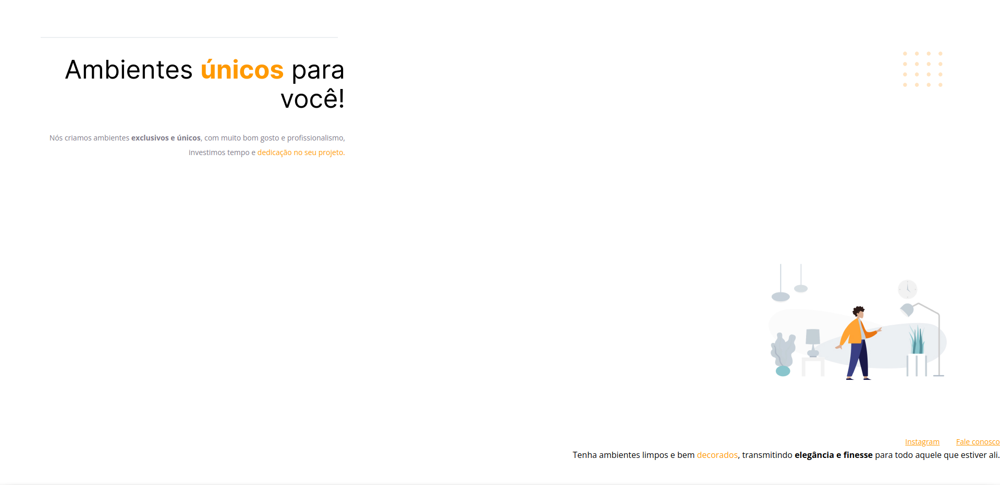

# DesafioFase1-CorrigindoBugs 🚀
Antes:

Depois:

Nesse projeto não criei um novo link pois o resultado é o projeto 1, que pode ser acessado [aqui](https://victorm-mp.github.io/Projeto1-Stage2/)

## Tecnologias 🛠
- HTML
- CSS
- Git e Github

## Descrição 📖
Visualmente bagunçado, o desafio consiste em organizar pra que fique do mesmo jeito que o design do Figma propôs. Esse projeto foi feito para melhor consolidação dos conceitos abordados no projeto 1, alterando os elementos visuais tanto na ordem no HTML, como nas propriedades pelo CSS.

## Contato ⭐
victormatheus.mpm@gmail.com

www.linkedin.com/in/victormatheus-mp
